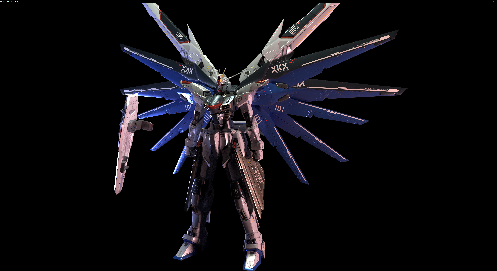
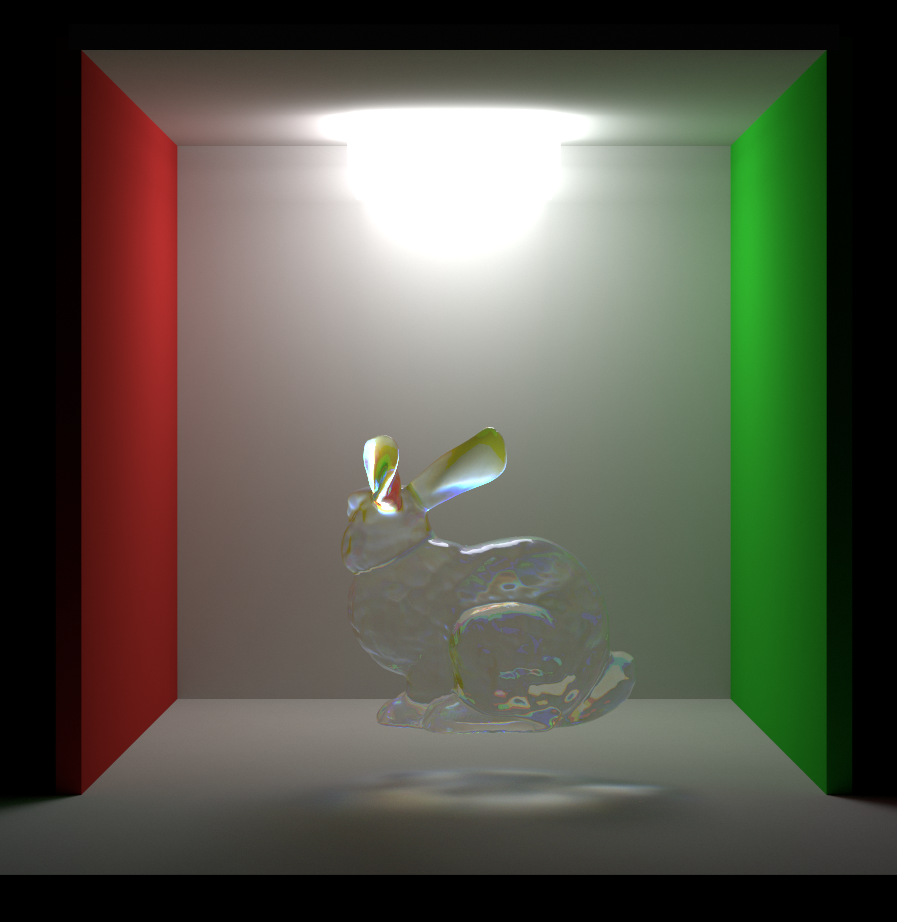
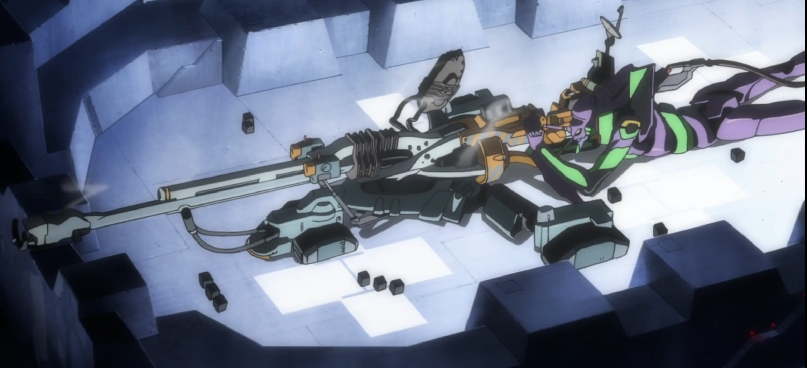

# Positron Sniper Rifle
A toy unidirectional path tracer based on NVIDIA Optix7, used as my graphics exercise, and simple enough to be used to learn Optix.

## Features

- Thanks to Optix API (and RT core), fully squeeze the performance out of the graphics card 

  Without full optimization, 2K resolution on a RTX4090 can achieve **real-time** level performance

- Next Event Estimation for any shape and number of light sources

- Two-level BVH for instancing (IAS and GAS in Optix)

- Disney BRDF and its metal/roughness workflows

- Bessel's parametric surface intersection based on Newton's iterative method

- Global fog, volume light, and dispersion

## Preview

## TODO

- Some denoise methods in real-time rendering
- Real-time scene editing

## Dependency

- [Nvidia Optix 7.7](https://raytracing-docs.nvidia.com/optix7/index.html)
- [TinyObjLoader](https://github.com/tinyobjloader/tinyobjloader)

## References

- [GAMES101:《现代计算机图形学入门》](https://sites.cs.ucsb.edu/~lingqi/teaching/games101.html)
- [Ray Tracing in One Weekend](https://github.com/petershirley/raytracinginoneweekend)
- [Physically Based Rendering: From Theory To Implementation](https://github.com/mmp/pbrt-v3) 
- [NVIDIA OptiXでRay tracing in One Weekend](https://qiita.com/sketchbooks99/items/de98db331f8c8d24628c)
- [Siggraph 2019/2020 OptiX 7/7.3 Course](https://github.com/ingowald/optix7course)
- [重要性采样和多重重要性采样在路径追踪中的应用](https://zhuanlan.zhihu.com/p/360420413)

## Why is it named Positron Sniper Rifle?

